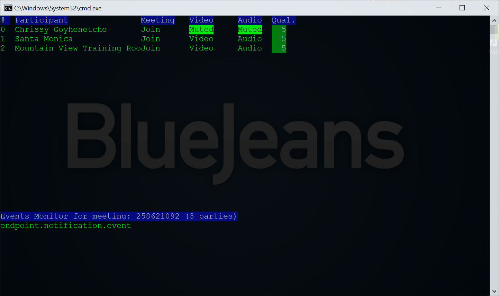

# BlueJean Meeting Event Monitor

## Reference Design for Monitoring BlueJeans Meeting Events

- 6/04/2018, g1, Update documentation about providing of a meeting passcode
- 11/6/2017, g1, Initial check-in
- 3/9/2018, g1, Add support for URL parsing

This Node JS application demonstrates how to employ the BlueJeans' Events SDK to enable an application to monitor the Video and Audio mute states for each participant in a meeting.

The meeting you wish to monitor must be scheduled without requiring an attendee passcode.  The application connects using a meeting access token obtained on behalf the organizer's id.

### To Install
1. Download the files from this git repository
2. give the command `npm install`

### To Run
The application is contained in the eventmon.js file.  It requires the BlueJeans numeric meeting ID as a parameter when launching:  

`node eventmon numeric_id`   or 
`node eventmon numeric_id.passcode`
`node eventmon https://bluejeans.com/numeric_id`  or 
`node eventmon https://bluejeans.com/numeric_id.passcode`

If the Meeting has assigned an *optional passcode*, you must provide that value.  If you are a moderator, you may substitute at any time the moderator code for the passcode value.

### In-Application Commands
When `eventmon` is running, the following keys are enabled:

| Keystroke | Command                                  |
| --------- | ---------------------------------------- |
| page down | scroll list to next set of 20 participants |
| page up   | scroll list to previous set of 20 participants |
| Ctrl-L    | Refresh the screen |
| Ctrl-C    | Quit application                         |

